<div align="center">

# 🤖 CAPTCHA Solver Agent
### Day 9 — Browser-Use AI Agent Series

<p align="center">
  
  
  
  
  
</p>

> **An AI agent that autonomously navigates to "I am not a robot" human verification pages, clicks the checkbox, handles image challenges, and records the entire session as a video.**

</div>

---

## 📌 What This Project Does

The CAPTCHA Solver Agent opens a real Chromium browser, navigates to Google reCAPTCHA v2, and attempts to solve it step by step:

1. Navigates to the demo page and waits for full load
2. Finds and clicks the "I am not a robot" checkbox inside its iframe
3. If an image challenge appears — reads the instruction, clicks matching tiles, clicks Verify
4. Loops through challenge rounds until solved or max attempts reached
5. Records the **entire browser session as an `.mp4` video**
6. Saves results to JSON + CSV, and a final screenshot

---

## 🗂️ Project Structure

```
day9-caption/
├── main.py              ← Entry point: LLM factory + site loop orchestration
├── config.py            ← Target sites list + all agent/LLM settings
├── captcha_agent.py     ← CaptchaAgent class (browser-use agent per site)
├── utils.py             ← Logging, JSON/CSV output, directory bootstrap
├── requirements.txt     ← Python dependencies
├── .env.example         ← Template for environment variables
├── output/
│   ├── results.json     ← Full structured results per site
│   └── results.csv      ← Tabular summary
├── screenshots/
│   └── Google_reCAPTCHA_v2/
│       └── final_HHmmss.png
├── videos/
│   └── Google_reCAPTCHA_v2/
│       └── session_HHmmss.mp4   ← Full session video recording
└── logs/
    └── captcha_YYYYMMDD_HHmmss.log
```

---

## 🔄 Process Flow

```mermaid
flowchart TD
    A([▶ python main.py]) --> B[Load .env + Config]
    B --> C[build_llm\nOpenRouter → Model]
    C --> D[CAPTCHA_SITES list\nGoogle reCAPTCHA v2]
    D --> E[CaptchaAgent.solve]

    subgraph agent ["CaptchaAgent — _run_once()"]
        E --> F[BrowserProfile\nrecord_video_dir · 1280×720\ndisable_security · load waits]
        F --> G[BrowserSession\nPlaywright Chromium]
        G --> H[📹 Video Recording Starts]
        H --> I[browser-use Agent\nuse_vision · max 50 steps]
        I --> J[Navigate to reCAPTCHA URL]
        J --> K[Find checkbox in iframe\nDOM index lookup]
        K --> L[Click checkbox]
        L --> M[Wait 4 seconds]
        M --> N{Image challenge\nappeared?}
        N -->|No| O[Green checkmark ✓\nVERIFIED]
        N -->|Yes| P[Read instruction text\nfrom DOM]
        P --> Q[Click tiles 0–8\nImage challenge grid]
        Q --> R[Click Verify button]
        R --> S{Solved?\ncheck DOM state}
        S -->|Yes| O
        S -->|New round| P
        S -->|3 rounds failed| T[FAILED]
        O --> U[done — SUCCESS]
        T --> U2[done — FAILED]
    end

    U & U2 --> V[session.kill]
    V --> W[Video finalized → .mp4]
    W --> X[Screenshot saved → .png]
    X --> Y[Extract result status\nSUCCESS · FAILED · PARTIAL · unknown]
    Y --> Z1[(output/results.json)]
    Y --> Z2[(output/results.csv)]

    style agent fill:#1a1a2e,stroke:#e17055,color:#fff
    style A fill:#00b894,color:#fff
    style H fill:#e17055,color:#fff
    style W fill:#e17055,color:#fff
    style Z1 fill:#6c5ce7,color:#fff
    style Z2 fill:#6c5ce7,color:#fff
    style O fill:#00b894,color:#fff
    style T fill:#d63031,color:#fff
```



---

## 🛠️ Tech Stack

<table>
<thead>
<tr><th>Technology</th><th>Version</th><th>Why Used</th></tr>
</thead>
<tbody>
<tr>
<td><b>browser-use</b></td>
<td>0.11.13</td>
<td>Core agent framework — connects an LLM to Playwright browser control. Handles DOM extraction, element clicking, iframe navigation, and built-in MP4 video recording. The agent "thinks" then takes browser actions.</td>
</tr>
<tr>
<td><b>Playwright</b></td>
<td>1.x</td>
<td>Underlies browser-use. Drives Chromium, handles JavaScript-heavy pages like reCAPTCHA iframes, and captures MP4 session recordings via <code>record_video_dir</code>.</td>
</tr>
<tr>
<td><b>OpenRouter API</b></td>
<td>—</td>
<td>Unified gateway to 200+ LLM providers. Used here for free-tier model access without paying per provider. Free models: <code>openai/gpt-oss-120b:free</code> (DOM), <code>google/gemma-4-31b-it:free</code> (vision).</td>
</tr>
<tr>
<td><b>openai/gpt-oss-120b:free</b></td>
<td>—</td>
<td>Primary model. 120B parameter text model — properly follows browser-use's strict JSON tool-calling schema. Handles navigation, checkbox clicking, DOM reading, Verify clicking.</td>
</tr>
<tr>
<td><b>google/gemma-4-31b-it:free</b></td>
<td>—</td>
<td>Vision model alternative. 31B multimodal model (text + image) — can actually SEE the traffic light images and select correct tiles. Use when Google AI Studio rate limits allow.</td>
</tr>
<tr>
<td><b>Video Recording</b></td>
<td>MP4</td>
<td>browser-use's built-in <code>record_video_dir</code> on <code>BrowserProfile</code> captures every click, scroll, and page change at 1280×720. Saved to <code>videos/&lt;SiteName&gt;/session_HHmmss.mp4</code> after session ends.</td>
</tr>
<tr>
<td><b>asyncio</b></td>
<td>stdlib</td>
<td>Async runtime required by browser-use. Allows multiple sites to run sequentially in the same event loop.</td>
</tr>
<tr>
<td><b>python-dotenv</b></td>
<td>1.x</td>
<td>Loads API keys and model names from <code>.env</code> — keeps credentials out of source code.</td>
</tr>
<tr>
<td><b>pandas</b></td>
<td>2.x</td>
<td>DataFrame → CSV export for results summary. One-liner output.</td>
</tr>
</tbody>
</table>

---

## ⚙️ Setup & Run

### 1. Install dependencies
```bash
pip install -r requirements.txt
playwright install chromium
```

### 2. Configure environment
```bash
cp .env.example .env
```
Edit `.env`:
```env
LLM_PROVIDER=openrouter
OPENROUTER_API_KEY=sk-or-v1-your-key-here

# Text-only model (works reliably, can't see images):
OPENROUTER_MODEL=openai/gpt-oss-120b:free

# Vision model (identifies correct image tiles, may be rate-limited):
# OPENROUTER_MODEL=google/gemma-4-31b-it:free

HEADLESS=false
CAPTURE_SCREENSHOTS=true
```

### 3. Run
```bash
python main.py
```

---

## 📊 Output Format

### `output/results.json`
```json
[
  {
    "site_name": "Google_reCAPTCHA_v2",
    "url": "https://www.google.com/recaptcha/api2/demo",
    "type": "checkbox",
    "status": "success",
    "agent_output": "SUCCESS - checkbox verified and CAPTCHA solved",
    "steps_taken": 12,
    "elapsed_seconds": 45.2,
    "screenshot_path": "screenshots/Google_reCAPTCHA_v2/final_130957.png",
    "video_path": "videos/Google_reCAPTCHA_v2/session_131010.mp4",
    "timestamp": "2026-05-03T13:10:10"
  }
]
```

### Status values

| Status | Meaning |
|--------|---------|
| `success` | Agent called `done()` with SUCCESS |
| `failed` | Agent called `done()` with FAILED after exhausting attempts |
| `partial` | Some challenge rounds completed but not fully verified |
| `unknown` | Agent ran all steps but never called `done()` |
| `error` | Python exception (browser crash, network error) |
| `rate_limited` | OpenRouter API 429 — daily free limit reached |

---

## 🎥 Video Recording

Every run produces an **MP4 screen recording** of the full browser session:

```
videos/
└── Google_reCAPTCHA_v2/
    └── session_131010.mp4   ← 1280×720, entire session
```

- Recording starts when the browser session opens
- Captures all agent clicks, typing, waits, page loads
- Finalized after `session.kill()` — 2 second buffer ensures complete write
- Named `session_HHmmss.mp4` to avoid overwriting previous runs

---

## 🔧 Configuration Reference

| Variable | Default | Description |
|----------|---------|-------------|
| `OPENROUTER_MODEL` | `openai/gpt-oss-120b:free` | LLM model |
| `MAX_AGENT_STEPS` | `50` | Max steps per site (image challenges need many) |
| `MAX_RETRIES` | `1` | Retries on hard exception only |
| `WAIT_BETWEEN_ACTIONS` | `1.5s` | Pause between each agent action |
| `PAGE_LOAD_WAIT` | `3.0s` | Min time to wait after navigation |
| `NETWORK_IDLE_WAIT` | `5.0s` | Wait for network to go idle |
| `HEADLESS` | `false` | Show browser window |
| `CAPTURE_SCREENSHOTS` | `true` | Save post-run screenshot |

---

## 🎯 Key Design Decisions

| Decision | Reason |
|----------|--------|
| **`use_vision=False` with text model** | `gpt-oss-120b:free` is text-only — sending screenshots causes 404. DOM-based clicking works for checkbox + tile grid navigation. |
| **`use_vision=True` with Gemma 4** | When vision model is active, agent takes screenshots and can actually identify traffic light images vs other content. |
| **`record_video_dir` on BrowserProfile** | browser-use's built-in video recorder — activated directly via `BrowserProfile` param, saves `.mp4` after session close. |
| **Click ALL tiles when no vision** | Without seeing images, clicking every tile attempts coverage. Google rejects it, but the process is demonstrated. |
| **50 max steps** | Image challenges can have 3+ rounds, each needing navigate + 9 clicks + verify. 50 steps needed for full coverage. |
| **3-layer output extraction** | `final_result()` → `is_done action` → `last action` fallback ensures output captured even if agent doesn't call `done()` cleanly. |
| **Result saved after every site** | JSON + CSV updated after each site — partial runs recoverable if agent crashes mid-list. |

---

## 🧩 Supported CAPTCHA Types

| Type | Description | Vision Needed |
|------|-------------|---------------|
| `checkbox` | "I am not a robot" checkbox + optional image grid | Optional (DOM for checkbox, vision for grid) |
| `image` | Pure image selection challenge | Yes |
| `turnstile` | Cloudflare "Verify you are human" | No (usually auto-passes) |
| `text` | Distorted text to type in field | Yes |

---

## ⚠️ Limitations

- **Free model rate limits**: OpenRouter free tier = ~50 requests/day. Vision models (Gemma 4) have additional upstream Google AI Studio rate limits.
- **CAPTCHA accuracy without vision**: Text-only models click all tiles blindly — Google keeps presenting new challenges.
- **reCAPTCHA bot detection**: Google detects automated browsers. Even with human-like timing, image challenges will appear for non-vision sessions.
- **Not for production scraping**: Intended for educational/demo purposes only. Always respect a website's Terms of Service.

---

<div align="center">

---

### 👨‍💻 Author

<a href="https://shreyash-orpin.vercel.app/" target="_blank">
  
</a>

**Shreyash Patil** — Built as Day 9 of a browser-use AI agent series

<sub>Free-tier AI + Playwright video recording · browser-use 0.11.13</sub>

</div>
