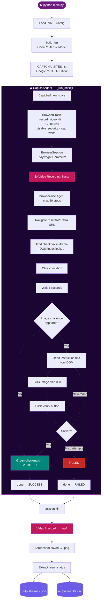

<div align="center">

[](https://git.io/typing-svg)

<br/>


</div>

---

## 📌 What This Project Does

The **CAPTCHA Solver Agent** opens a real Chromium browser, navigates to Google reCAPTCHA v2, and attempts to solve it step by step:

1. Navigates to the demo page and waits for full load
2. Finds and clicks the **"I am not a robot"** checkbox inside its iframe
3. If an image challenge appears — reads the instruction, clicks matching tiles, clicks Verify
4. Loops through challenge rounds until solved or max attempts reached
5. Records the **entire browser session as an `.mp4` video**
6. Saves results to **JSON + CSV**, and a final screenshot

---

## 🗂️ Project Structure

```
day9-caption/
├── main.py              ← Entry point: LLM factory + site loop orchestration
├── config.py            ← Target sites list + all agent/LLM settings
├── captcha_agent.py     ← CaptchaAgent class (browser-use agent per site)
├── utils.py             ← Logging, JSON/CSV output, directory bootstrap
├── requirements.txt     ← Python dependencies
├── .env.example         ← Template for environment variables
├── output/
│   ├── results.json     ← Full structured results per site
│   └── results.csv      ← Tabular summary
├── screenshots/
│   └── Google_reCAPTCHA_v2/
│       └── final_HHmmss.png
├── videos/
│   └── Google_reCAPTCHA_v2/
│       └── session_HHmmss.mp4   ← Full session video recording
└── logs/
    └── captcha_YYYYMMDD_HHmmss.log
```

---

## 🔄 Process Flow



---

## 🛠️ Tech Stack

<table>
<thead>
<tr><th width="200">Technology</th><th width="120">Version</th><th>Why Used</th></tr>
</thead>
<tbody>
<tr>
<td><b>🤖 browser-use</b></td>
<td>0.11.13</td>
<td>Core agent framework — connects LLM to Playwright browser. Handles DOM extraction, iframe navigation, element clicking, and built-in MP4 video recording via <code>record_video_dir</code>.</td>
</tr>
<tr>
<td><b>🎭 Playwright</b></td>
<td>1.x</td>
<td>Underlies browser-use. Drives Chromium, handles JavaScript-heavy reCAPTCHA iframes, and captures MP4 session recordings.</td>
</tr>
<tr>
<td><b>🔀 OpenRouter API</b></td>
<td>—</td>
<td>Unified gateway to 200+ LLM providers. Enables free-tier model access — no separate accounts needed per provider.</td>
</tr>
<tr>
<td><b>🧠 gpt-oss-120b:free</b></td>
<td>free</td>
<td>Primary model. 120B text model — reliably follows browser-use's strict JSON tool-calling schema. Used for navigation, checkbox clicking, DOM reading.</td>
</tr>
<tr>
<td><b>👁️ gemma-4-31b:free</b></td>
<td>free</td>
<td>Vision model alternative. 31B multimodal (text + image) — can SEE the traffic light images and select correct tiles. Use when Google AI Studio rate limits allow.</td>
</tr>
<tr>
<td><b>🎥 Video Recording</b></td>
<td>MP4 1280×720</td>
<td>browser-use's built-in <code>record_video_dir</code> on <code>BrowserProfile</code> captures every action. Saved to <code>videos/&lt;SiteName&gt;/session_HHmmss.mp4</code> after session closes.</td>
</tr>
<tr>
<td><b>⚡ asyncio</b></td>
<td>stdlib</td>
<td>Async runtime required by browser-use. Allows multiple sites in the same event loop.</td>
</tr>
<tr>
<td><b>🔐 python-dotenv</b></td>
<td>1.x</td>
<td>Loads API keys from <code>.env</code> — keeps credentials out of source code.</td>
</tr>
</tbody>
</table>

---

## ⚙️ Setup & Run

### 1. Install dependencies
```bash
pip install -r requirements.txt
playwright install chromium
```

### 2. Configure environment
```bash
cp .env.example .env
```
Edit `.env`:
```env
LLM_PROVIDER=openrouter
OPENROUTER_API_KEY=sk-or-v1-your-key-here

# Text-only model (reliable, no image recognition):
OPENROUTER_MODEL=openai/gpt-oss-120b:free

# Vision model (identifies correct image tiles):
# OPENROUTER_MODEL=google/gemma-4-31b-it:free

HEADLESS=false
CAPTURE_SCREENSHOTS=true
```

### 3. Run
```bash
python main.py
```

---

## 📊 Output Format

### `output/results.json`
```json
[
  {
    "site_name": "Google_reCAPTCHA_v2",
    "url": "https://www.google.com/recaptcha/api2/demo",
    "type": "checkbox",
    "status": "success",
    "agent_output": "SUCCESS - checkbox verified and CAPTCHA solved",
    "steps_taken": 12,
    "elapsed_seconds": 45.2,
    "screenshot_path": "screenshots/Google_reCAPTCHA_v2/final_130957.png",
    "video_path": "videos/Google_reCAPTCHA_v2/session_131010.mp4",
    "timestamp": "2026-05-03T13:10:10"
  }
]
```

### Status Values

| Status | Meaning |
|--------|---------|
| ✅ `success` | Agent solved CAPTCHA — `done()` called with SUCCESS |
| ❌ `failed` | Agent exhausted attempts — `done()` called with FAILED |
| 🔶 `partial` | Some rounds completed but not fully verified |
| ❓ `unknown` | Agent ran all steps but never called `done()` |
| 💥 `error` | Python exception — browser crash or network error |
| 🚫 `rate_limited` | OpenRouter 429 — daily free limit reached |

---

## 🎥 Video Recording

Every run produces an **MP4 screen recording** of the full browser session:

```
videos/
└── Google_reCAPTCHA_v2/
    └── session_131010.mp4   ← 1280×720, entire session captured
```

- Recording starts when the browser session opens
- Captures all agent clicks, waits, and page loads
- Finalized 2 seconds after `session.kill()` — ensures complete write
- Named `session_HHmmss.mp4` — no overwriting of previous runs

---

## 🔧 Configuration Reference

| Variable | Default | Description |
|----------|---------|-------------|
| `OPENROUTER_MODEL` | `openai/gpt-oss-120b:free` | LLM model |
| `MAX_AGENT_STEPS` | `50` | Max steps per site |
| `MAX_RETRIES` | `1` | Retries on hard exception only |
| `WAIT_BETWEEN_ACTIONS` | `1.5s` | Pause between agent actions |
| `PAGE_LOAD_WAIT` | `3.0s` | Min wait after navigation |
| `NETWORK_IDLE_WAIT` | `5.0s` | Wait for network idle |
| `HEADLESS` | `false` | Show browser window |
| `CAPTURE_SCREENSHOTS` | `true` | Save post-run screenshot |

---

## 🧩 Supported CAPTCHA Types

| Type | Description | Vision Needed |
|------|-------------|:---:|
| `checkbox` | "I am not a robot" checkbox + optional image grid | Optional |
| `image` | Pure image selection challenge | ✅ Yes |
| `turnstile` | Cloudflare "Verify you are human" | ❌ No |
| `text` | Distorted text to type in field | ✅ Yes |

---

## ⚠️ Limitations

- **Free model rate limits** — OpenRouter free tier ~50 requests/day. Vision models (Gemma 4) have additional upstream Google AI Studio rate limits
- **CAPTCHA accuracy without vision** — Text-only models click all tiles blindly; Google keeps presenting new challenges
- **Bot detection** — Google flags automated browsers; image challenges appear even with human-like timing
- **Educational only** — Intended for demo purposes. Always respect a site's Terms of Service

---


<div align="center">

### 👨‍💻 Author

<a href="https://shreyash-orpin.vercel.app/" target="_blank">
  
</a>

**Shreyash Patil** — Built as Day 9 of a browser-use AI agent series

<sub>Free-tier AI + Playwright video recording · browser-use 0.11.13</sub>

</div>
